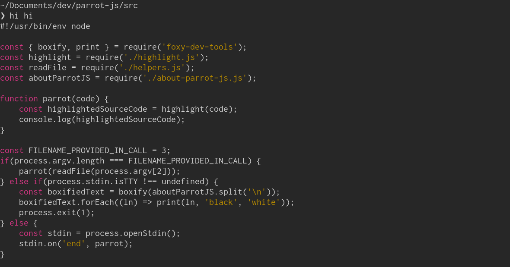

```
  (@>  
 {||
--""--
  ||
  ||

PARROT JS vs sed
- a Bash syntax highlighter for JavaScript
(and similar languages)
```

(From my machine, POP_OS!)

This is a simplistic Bash JavaScript syntax highlighter. It doesn't use a parser, only regular expressions.
Use it if you want, but if you need a good syntax highlighter for Bash you should look elsewhere. This project
is only meant to compare two versions. One using JavaScript, one using sed.

Often we use JavaScript or similar languages to solve small problems. This is sometimes a mistake and this is an example. Surely, we could make a more advanced syntax highlighter
but this is advanced enough. Already with a simplistic solution, we have some
quantity code.

Is JavaScript the right tool for the job? It depends on the scope. If the scope is small
my answer is no. Compare my JavaScript solution with my sed solution. The sed/Bash-solution
is very simple, but does the job. 

Also, if we make a (un-systematic though) benchmark using the
gnu tool time we see a huge difference in performance. The sed-version is, when used on the example-file,
close to 5-6 times faster *on my machine. However, we should not trust micro-benchmarks. But more importantly here,
the difference in speed doesn't really matter in this context.

`$ time ./hi-sed example-js-file.js` outputs,
```
real    0m0.008s
user    0m0.006s
sys     0m0.003s
```

while `$ time ./hi-js example-js-file.js` outputs,
```
real    0m0.037s
user    0m0.033s
sys     0m0.008s
```

# JavaScript-version

### Setup

```
npm install
```

### Usage

```
// 1
./hi-js example-js-file.js

// 2
cat example-js-file.js | ./hi-js
```

# sed-version

### Usage

```
# 1
./hi-sed example-js-file.js

# 2
cat example-js-file.js | ./hi-sed
```
